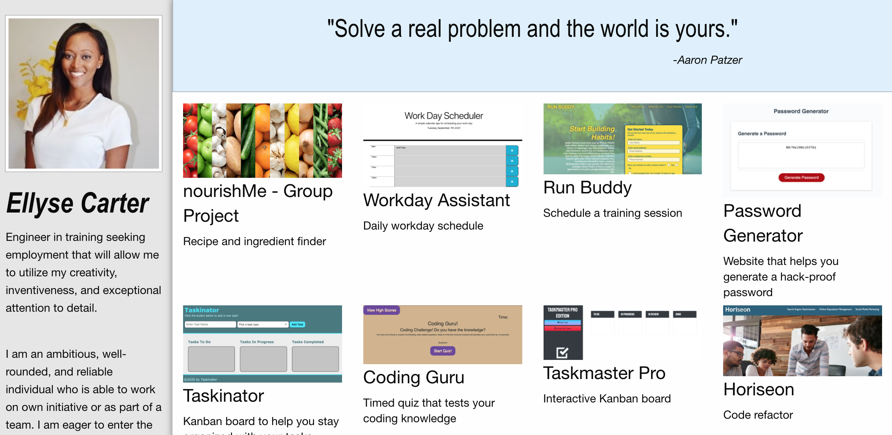

# Portfolio Project

#### This is a site made by HTML, CSS and Foundation

#### Ellyse Carter

## Description
This site is a home page for my portfolio. On the left panel it has a brief description, the main section has screenshots of my work that are linked to the deployed sites, and there is a contact section with a form at the bottom.  

## Setup/Installation Requirements
Open terminal or a similar app on your computer
change directory to Desktop
copy https://github.com/ellysecarter/portfolio
use git clone and paste that link after it to clone the repository
open the folder it provides
open the HTML folder inside
https://ellysecarter.github.io/portfolio/

## Known Bugs
None known

## Contact Details
email: ellysecarter@yahoo.com

Technologies Used
HTML CSS Foundation

